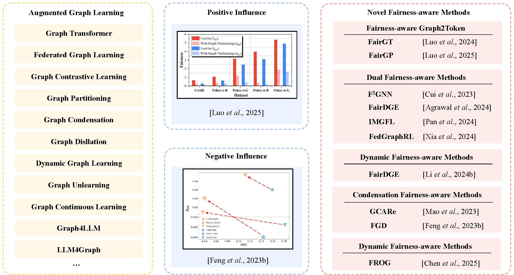

### Awesome FairGX
Augmented graph learning (AGL) has emerged as a powerful direction in modern graph modelling, integrating specialised machine learning techniques—such as federated graph learning, graph contrastive learning, and graph transformers—into traditional graph learning frameworks. These augmentations substantially improve model capability across diverse applications. This repo investigates the fairness challenges unique to AGL. It analyses how augmentation influences model behaviour, identifies key sources of unfairness, and reviews major techniques designed to mitigate these issues. 

### Illustration of the survey

### The open datasets of fairness-aware AGL
| Dataset         | Cite | Tasks                | Augmenting Machine Learning                         | Sensitive Attribute | Fairness Types   |
|-----------------|------|----------------------|------------------------------------------------------|---------------------|------------------|
| MovieLens-100K  | [1]  | Recommender System   | Federated Learning                                   | Gender              | Group Fairness   |
| MovieLens-1M    | [1]  | Recommender System   | Federated Learning                                   | Gender              | Group Fairness   |
| Amazon-Movies   | [2]  | Recommender System   | Federated Learning                                   | None                | Degree Bias      |
| MovieLens-10M   | [1]  | Recommender System   | Dynamic Learning                                     | Gender              | Group Fairness   |
| Amazon-Books    | [3]  | Recommender System   | Dynamic Learning                                     | None                | Degree Bias      |
| GoodReads       | [3]  | Recommender System   | Dynamic Learning                                     | None                | Degree Bias      |
| Pokec-z-G       | [4]  | Node Classification  | Transformer                                          | Gender              | Group Fairness   |
| Pokec-z-R       | [4]  | Node Classification  | Transformer / Federated Learning / Condensation      | Region              | Group Fairness   |
| Pokec-n-G       | [4]  | Node Classification  | Transformer                                          | Gender              | Group Fairness   |
| Pokec-n-R       | [4]  | Node Classification  | Transformer / Federated Learning / Condensation      | Region              | Group Fairness   |
| AMiner-L        | [5]  | Node Classification  | Transformer                                          | Affiliation         | Group Fairness   |
| NBA             | [6]  | Node Classification  | Transformer                                          | Nationality         | Group Fairness   |
| German          | [7]  | Node Classification  | Transformer / Condensation                           | Gender              | Group Fairness   |
| Bail/Recidivism | [8]  | Node Classification  | Transformer / Condensation                           | Race                | Group Fairness   |
| Credit          | [9]  | Node Classification  | Transformer / Condensation                           | Age                 | Group Fairness   |
| Income          | [7]  | Node Classification  | Transformer                                          | Race                | Group Fairness   |
| Cora            | [10] | Node Classification  | Condensation / Unlearning                            | None                | Degree Bias      |
| Ogbn-arxiv      | [11] | Node Classification  | Condensation                                         | None                | Degree Bias      |
| Citeceer        | [12] | Node Classification  | Unlearning                                           | None                | Degree Bias      |
| Pubmed          | [12] | Node Classification  | Unlearning                                           | None                | Degree Bias      |
| Facebook        | [13] | Node Classification  | Unlearning                                           | Gender              | Group Fairness   |
| PROTEINS        | [14] | Graph Classification | Federated Learning                                   | None                | Degree Bias      |
| DD              | [15] | Graph Classification | Federated Learning                                   | None                | Degree Bias      |
| IMDB-BINARY     | [16] | Graph Classification | Federated Learning                                   | None                | Degree Bias      |
| HAM10k          | [17] | Graph Classification | Federated Learning                                   | None                | Degree Bias      |
| Fed-DRG         | [18] | Graph Classification | Federated Learning                                   | None                | Degree Bias      |

### References

[1] Harper, F. M., & Konstan, J. A. (2015). *The MovieLens Datasets: History and Context*. ACM Transactions on Interactive Intelligent Systems.

[2] Ni, J., Li, J., & McAuley, J. (2019). *Justifying Recommendations using Distantly-Labeled Reviews and Fine-Grained Aspects*. EMNLP-IJCNLP.

[3] Li, Y., Yang, Y., Cao, J., Liu, S., Tang, H., & Xu, G. (2024). *Toward Structure Fairness in Dynamic Graph Embedding: A Trend-aware Dual Debiasing Approach*. KDD.

[4] Takac, L., & Zabovsky, M. (2012). *Data Analysis in Public Social Networks*. Present Day Trends of Innovations.

[5] Wan, H., Zhang, Y., Zhang, J., & Tang, J. (2019). *AMiner: Search and Mining of Academic Social Networks*. Data Intelligence.

[6] Dai, E., & Wang, S. (2023). *Learning Fair Graph Neural Networks with Limited and Private Sensitive Attribute Information*. IEEE TKDE.

[7] Asuncion, A., & Newman, D. (2007). *UCI Machine Learning Repository*.

[8] Jordan, K. L., & Freiburger, T. L. (2015). *The effect of race/ethnicity on sentencing*. Journal of Ethnicity in Criminal Justice.

[9] Yeh, I., & Lien, C. (2009). *The Comparisons of Data Mining Techniques for Predicting Credit Card Default*. Expert Systems with Applications.

[10] Kipf, T. N., & Welling, M. (2017). *Semi-Supervised Classification with Graph Convolutional Networks*. ICLR.

[11] Hu, W., Fey, M., Zitnik, M., Dong, Y., Ren, H., Liu, B., Catasta, M., & Leskovec, J. (2020). *Open Graph Benchmark*. NeurIPS.

[12] Bojchevski, A., & Günnemann, S. (2018). *Deep Gaussian Embeddings of Graphs*. ICLR.

[13] Leskovec, J., & McAuley, J. (2012). *Learning to Discover Social Circles in Ego Networks*. NeurIPS.

[14] Borgwardt, K. M., Ong, C. S., Schönauer, S., Vishwanathan, S. V. N., Smola, A. J., & Kriegel, H.-P. (2005). *Protein Function Prediction via Graph Kernels*. Bioinformatics.

[15] Dobson, P. D., & Doig, A. J. (2003). *Distinguishing Enzyme Structures from Non-Enzymes without Alignments*. Journal of Molecular Biology.

[16] Yanardag, P., & Vishwanathan, S. V. N. (2015). *Deep Graph Kernels*. KDD.

[17] Tschandl, P., Rosendahl, C., & Kittler, H. (2018). *The HAM10000 Dataset*. Scientific Data.

[18] Xia, Y., Ma, B., Dou, Q., & Xia, Y. (2024). *Enhancing Federated Learning Performance Fairness via Collaboration Graph-based Reinforcement Learning*. MICCAI.

